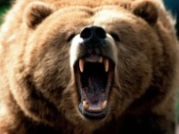
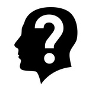
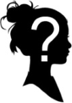
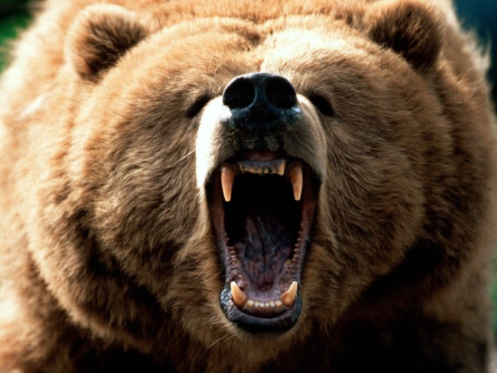
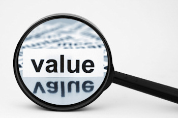
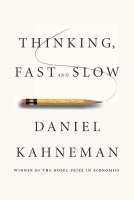
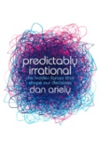
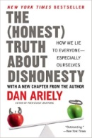

- title : Behavioral economics
- description : The worst team ever
- author : Gien Verschatse
- theme : night
- transition : default

***

### WTE (worst team EVER)

***

### Meet Owen Ship

***

### What is happening?

Ascribing more value to things because you **created or own** them

***

### What's in a name

 The endowment effect (Behavioral economics)

>Due to loss aversion (loss > gain)

 Ownership effect (social psychology)

>Part of our identity

 The ikea effect (extension)

>time + effort => completion

***

### How do we tackle it?

- How much do I want x, compared with y?
- split time and effort (we sort of need completion)
- being poor (seriously.)

### Flip it around!

- engage people by creating ownership

***

### Want to know more? 

**Daniel Kahneman**
  

  
**Dan Ariely**
  

