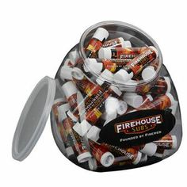
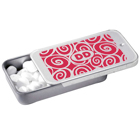
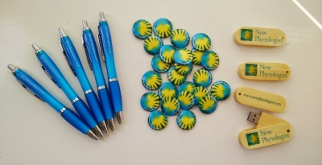
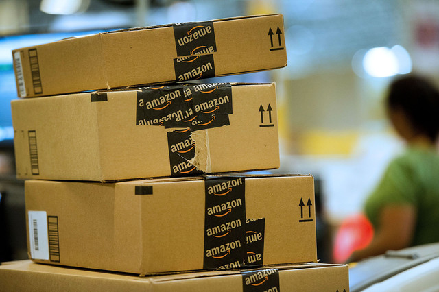
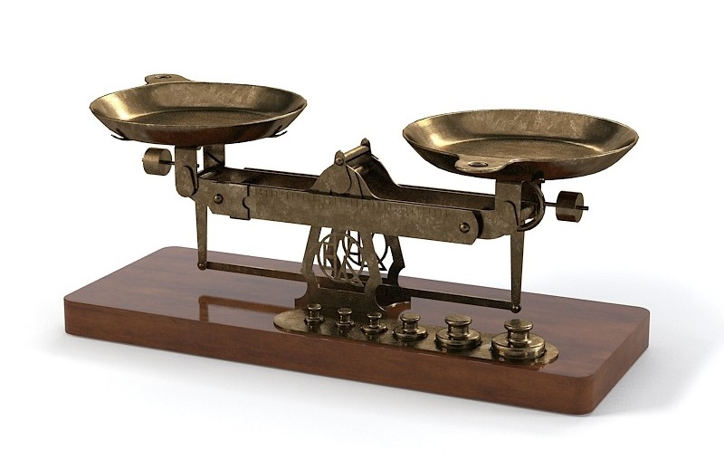

- title : Power Of Free
- description : Introductions to social behavior: free
- author : Gien Verschatse
- theme : night
- transition : default

***

### Gadgets, gadgets everywhere!

***

### Amazon and me

***

### The Power of Free

***

### What normally happens
#### COST - BENEFIT ANALYSES

***

### What happens instead
#### COST - BENEFIT ANALYSES

***

### The cost of free

#### Consumer
* rational decision making fades
* end up with something you don't want/need
* or a lesser product
* (sometimes) you pay with time

---

#### Owner
* bigger crowds => bigger budget
* wrong crowd => wrong feedback

***

### The upside?

* increase sales
* decrease costs
* health policies
* better customer relationships -- but that is a whole different topic ;-)